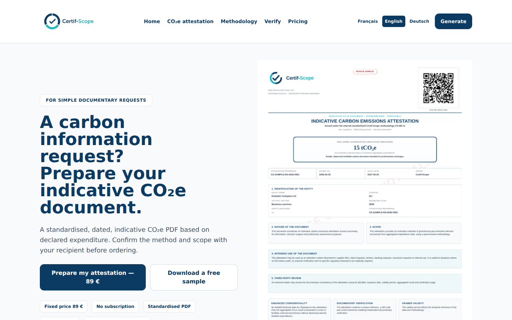
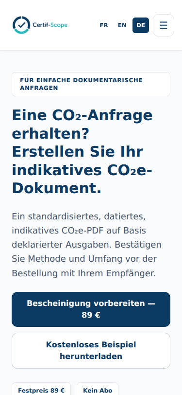

# Certif-Scope — harmonisation anglais / allemand

Base : `b5a5d002af3b0e31697079a011545c631d79cfa7` de la branche `fix/conversion-readability-20260930`.
Branche locale : `fix/multilingual-fr-en-de-20261001`.

## Résultat

Les parcours principaux EN et DE reprennent la présentation claire et le fonctionnement en trois étapes du français. Les pages accueil, produit, tarifs, méthode, limites, contact, génération, vérification et retour de paiement sont harmonisées. Les pages légales anglaises sont ajoutées. Les articles et pages légales allemandes existantes sont conservés.

Un seul formulaire EN/DE et des dictionnaires séparés évitent les divergences. Le modèle CS-SB-v1, ses sept coefficients et son arrondi restent inchangés. La langue du site et celle du document sont indépendantes. Le secteur est traduit dans la langue du PDF ; le récapitulatif indique cette langue. Stripe et les retours de paiement suivent la langue du site ; les QR codes suivent celle du PDF. Les trois langues proposées correspondent aux trois modèles disponibles.

Les redirections qui rendaient `/en/` inaccessible sont retirées. Les liens de langues pointent vers les pages correspondantes. Les langues HTML, canonicals, hreflang, sitemap et exclusions des retours de paiement sont mis à jour.

## Validation

- `npm run build` : réussite, compilation et TypeScript.
- `node scripts/check-ui-regressions.cjs` : réussite, nombres FR et coefficients inchangés.
- `node scripts/check-multilingual.cjs` : réussite, neuf combinaisons site/document, locales non prises en charge refusées, retours des packs, trois modèles PDF, secteurs et liens QR traduits, paiement non confirmé refusé.
- `CHROMIUM_EXECUTABLE_PATH=/tmp/certif-chromium node scripts/check-multilingual-browser.cjs` : contrôles Chromium locaux des pages FR/EN/DE, bureau 1440px et mobile 375px, langue HTML et absence de débordement horizontal, validations EN/DE, trois étapes, sept montants de 1000 € donnant 1,9 tCO₂e, langue du PDF dans le récapitulatif et requête de paiement simulée. Les 19 routes complémentaires EN/DE répondent 200 et une route anglaise inconnue répond 404.
- Rendus des modèles PDF personnalisés EN et DE : deux pages A4 ; seconde page allemande inspectée visuellement.

Les appels Stripe, PDFShift et la signature sont simulés dans les tests de contrat. Aucun paiement réel, envoi d’email ou crédit client n’a été utilisé. La livraison et l’email après un vrai paiement restent à vérifier sur une prévisualisation connectée.

L’outil agent-browser ne pouvait pas démarrer son daemon à cause des sockets Unix interdites. La vérification a été effectuée avec Puppeteer/Chromium installé dans le projet, via un pipe et un serveur Next dans le même processus de test.

## Livraison

La correction est préparée localement. Aucun déploiement de cette correction n’a été réalisé. La publication GitHub a été explicitement autorisée par Jeason le 1er octobre 2026. La mise en production n’est pas effectuée à ce stade.

La base de travail contient des changements postérieurs à la version actuellement en production. Ouvrir une PR vers la branche de base pour isoler cette correction ; ne pas promouvoir l’ensemble sans examiner ces changements préexistants.

